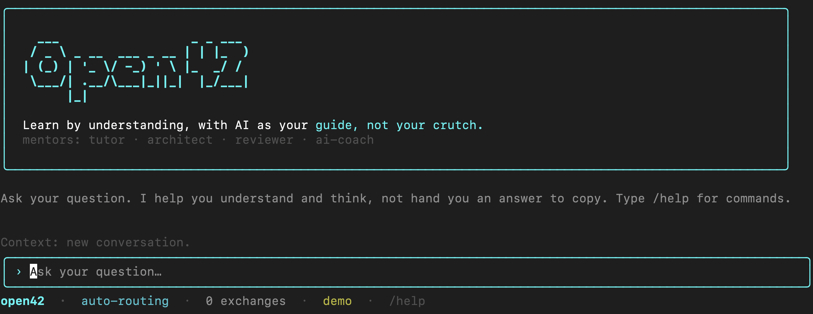

# Open42

> A portable, provider-agnostic **Socratic mentoring harness** that helps
> students learn to code, reason, architect, review - **and use AI well without
> becoming dependent on it.**

[](./LICENSE)



## Quick start

Requires Node.js 20+.

```bash
git clone https://github.com/Cimeci/Open42.git
cd Open42
npm install
npm start                # on first run, it asks which provider you want
```

Pick your model:

```bash
# free & local, no API key (start a model first: ollama run llama3.1):
npm start -- --provider ollama

# or with a hosted key:
ANTHROPIC_API_KEY=sk-ant-... npm start
```

(Once published to npm, running it will be as simple as `npx open42`.)

Open42 turns any capable LLM into a team of patient mentors instead of an answer
machine. It is built in the spirit of [42](https://42.fr)'s pedagogy -
**autonomy, peer-learning, learning by doing, and the conviction that productive
struggle is how understanding is born.**

The underlying method is *maïeutics*: the Socratic art of helping someone give
birth to knowledge they already carry. The mentors **help you understand and
think; they don't just hand you an answer to copy.**

## The problem Open42 exists to solve

LLMs make it trivial to get working code in seconds. For a learner that is a
trap: copy-paste a generated solution and you ship working code and learn
nothing. Worse, you build a *dependence* on the tool instead of the skill to
command it.

Open42 has two goals at once:

1. **Learn to think** - debug, reason, design, and review *yourself*.
2. **Learn to wield AI** - go faster and further *with* AI while staying able to
   work *without* it.

> Dependence is using AI to **avoid** thinking. Mastery is using AI to
> **amplify** thinking. Every interaction nudges the student from the first
> toward the second.

## What's inside

### A team of mentors (sub-agents)

Each mentor is a specialised sub-agent with its own system prompt, sharing one
foundation (the same guardrails, independence creed, and Socratic method):

| Mentor | id | Helps the student… |
|--------|----|--------------------|
| **Socratic Tutor** | `tutor` | debug and reason through problems methodically. |
| **Architecture Mentor** | `architect` | weigh design choices and trade-offs. |
| **Code Review Mentor** | `reviewer` | critique their *own* code. |
| **AI Literacy Coach** | `ai-coach` | decompose, prompt, **verify**, and judge when *not* to use AI. |

A **router** dispatches each student message to the right mentor. The default
`HeuristicRouter` is fast and free but keyword-based (English + French shipped);
for robust routing in any language, use the `LlmRouter`, which lets the model
classify the request.

### A customisable architecture

Register your own mentors - the same way 42 builds learning from modular
projects:

```ts
open42.registerMentor({
  id: "sec-coach",
  title: "Security Coach",
  description: "Helps you find security issues in your own code.",
  domains: ["review"],                 // reuse built-in domain prompts…
  // …or supply a fully custom `prompt` and/or `extraInstructions`
  routeKeywords: ["security", "vulnerability", "injection"],
});
```

### The guardrails (non-negotiable)

1. **Lead with understanding, not answers.** Guide first; never hand over a
   copy-pasteable solution that lets the student skip the learning.
2. **One good question beats ten hints.**
3. **You must understand what you ship.** Output must never outrun understanding.
4. **Verify everything.** AI (including the mentor) is sometimes confidently wrong.
5. **Protect the productive struggle**, and hold the line warmly when a student
   begs for the answer.

## Run it in your terminal

Open42 ships a terminal app (built with [Ink](https://github.com/vadimdemedes/ink),
like Claude Code and Codex). Bring your own model:

```bash
npm install
npm start          # builds, then launches the mentor
# or, once published:  npx open42
```

Replies **stream** in token by token, like Claude Code.

On first run it asks **what you want to use** and adapts:

- **Anthropic (Claude)** or **OpenAI (GPT)** - hosted, needs an API key
  (`sk-ant-…` / `sk-…`), saved to `~/.open42/config.json` (chmod 600). You can
  also set `ANTHROPIC_API_KEY` / `OPENAI_API_KEY` and skip onboarding.
- **Local (Ollama)** - **free, no key.** Run a model first (`ollama run llama3.1`),
  then pick "Local". Perfect for students without an API budget. Local models
  automatically get a **compact prompt** so smaller models still follow the
  guardrails.

Pick non-interactively with `open42 --provider ollama` (or `anthropic`/`openai`)
and `--model <name>`.

What it looks like:

```
you › Ma fonction récursive renvoie undefined, je comprends pas pourquoi.

Tutor ›
Bonne question. Prends le cas le plus simple qui marche déjà : pour n = 1,
que RENVOIE réellement la ligne qui fait l'appel récursif ? Lis-la à voix haute.

you ›
```

Each reply is badged with the mentor that answered (colour-coded). In-app
commands:

| Command | Effect |
|---------|--------|
| `/help` | list commands |
| `/mentors` | list available mentors |
| `/mentor <id>` | pin a mentor (e.g. `/mentor ai-coach`) |
| `/auto` | resume automatic routing |
| `/lang <auto\|fr\|en>` | change the language |
| `/remember` | save a short summary of this session to local memory |
| `/memory` | show what is remembered |
| `/forget` | erase all memory |
| `/clear` | clear the conversation |
| `/quit` | exit |

### Memory (optional, 100% local)

Open42 can remember across sessions to help the mentor calibrate over time. It is
deliberately conservative and private:

- **You** decide when to save, with `/remember` (it writes a short, human-readable
  summary to `~/.open42/memory/`).
- It stores **understanding, not content**: what you worked on and what's still
  shaky - never your solutions or code, never your API key.
- It **never overstates mastery** (no model "grading" you into "mastered").
- Past summaries are injected at the next session's start for continuity; read
  them with `/memory`, wipe everything with `/forget`. Plain Markdown you can open
  and edit yourself.

### Language

By default (`auto`), the mentor **mirrors the language you write in** - write in
French, get French; write in Spanish, get Spanish. Pick a fixed language with
`open42 --lang fr` (or `en`), the first-run prompt (press Tab to switch), or
`/lang` in-app. A fixed choice also localizes the interface (currently FR/EN) and
is saved to `~/.open42/config.json`. Press <kbd>Ctrl+C</kbd> during a reply to
cancel it; twice when idle to quit.

## Architecture

```
open42/
├── prompts/              # ← the heart: language-agnostic Markdown (source of truth)
│   ├── persona.md        #   who the mentor is
│   ├── guardrails.md     #   the core rules (lead with understanding, not answers)
│   ├── independence.md   #   using AI without depending on it (in every mentor)
│   ├── method.md         #   the Socratic loop
│   ├── calibration.md    #   gauging level & scaffolding
│   └── domains/          #   debugging · reasoning · architecture · review · ai-literacy
├── src/                  # TypeScript reference implementation
│   ├── open42.ts         #   the orchestrator (routes to mentors)
│   ├── mentors.ts        #   built-in mentors + extensible registry
│   ├── router.ts         #   HeuristicRouter · LlmRouter
│   ├── harness.ts        #   Maieutic - the single-mentor primitive
│   ├── prompts.ts        #   composes system prompts from the modules
│   ├── providers/        #   provider-agnostic adapters (Anthropic, OpenAI, …)
│   ├── cli/              #   the terminal app (Ink/React TUI)
│   └── types.ts
├── bin/open42.mjs        # the `open42` executable
├── examples/             # library usage examples
└── scripts/              # builds the prompts into the bundle
```

**You do not need TypeScript to use Open42.** The pedagogy lives in `prompts/`.
Concatenate the foundation files plus the domains you want and paste the result
as a system prompt - that *is* the harness.

## Quickstart (TypeScript)

```bash
npm install
npm run build
```

```ts
import { Open42, AnthropicProvider } from "open42";

const open42 = new Open42({
  provider: new AnthropicProvider({ apiKey: process.env.ANTHROPIC_API_KEY! }),
  rigor: "strict", // never reveal the solution
});

const reply = await open42.respond([
  { role: "student", content: "My recursive function returns undefined and I don't know why." },
]);

console.log(reply.mentor);  // → "tutor" (auto-routed)
console.log(reply.content); // → a question, not a fix
```

See [`examples/`](./examples) - including an **offline inspector** that needs no
API key and shows exactly what the harness composes and sends.

## Quickstart (no code)

1. Open [`prompts/`](./prompts).
2. Concatenate `persona.md` + `guardrails.md` + `independence.md` + `method.md` +
   `calibration.md` and the domain files you want.
3. Paste the result as the **system prompt** of your favourite assistant.

## Contributing

Open42 is built for - and we hope by - the global student community. Better
questions, new mentors, and translations are all welcome. See
[CONTRIBUTING.md](./CONTRIBUTING.md).

## License

[MIT](./LICENSE) - free to use, fork, and adapt, including by schools.
